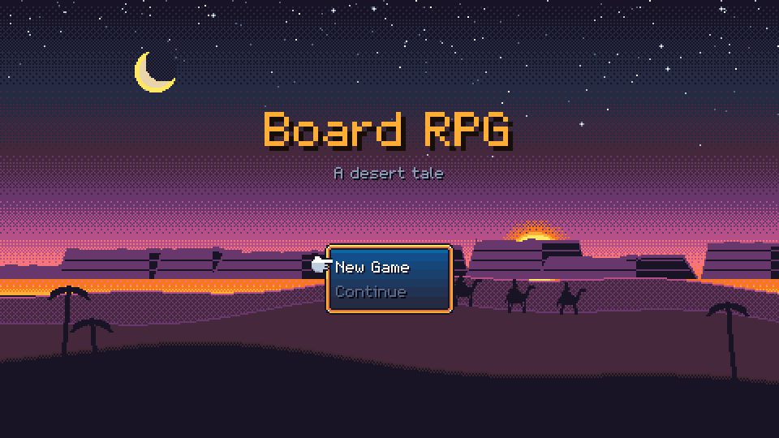
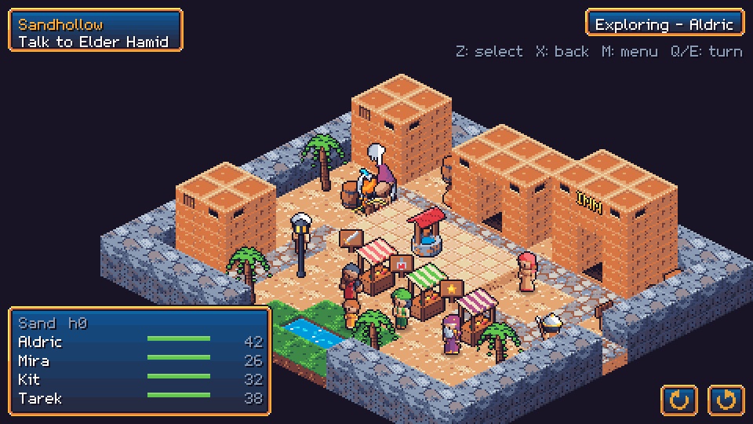
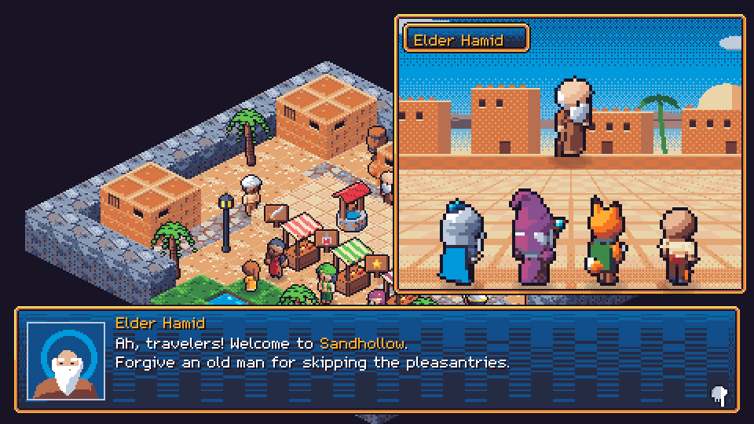
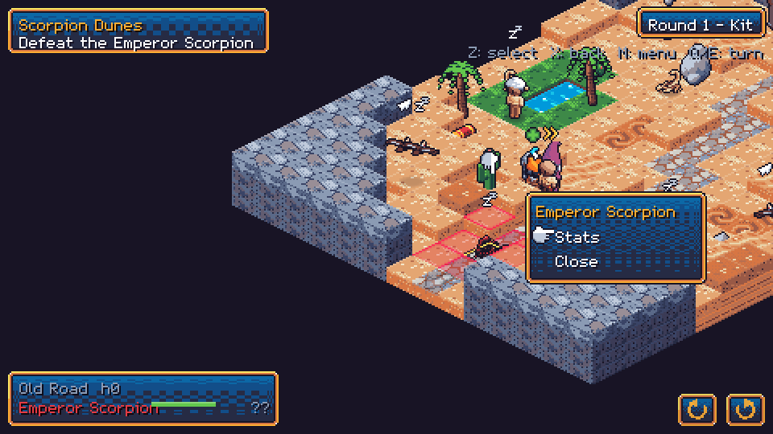
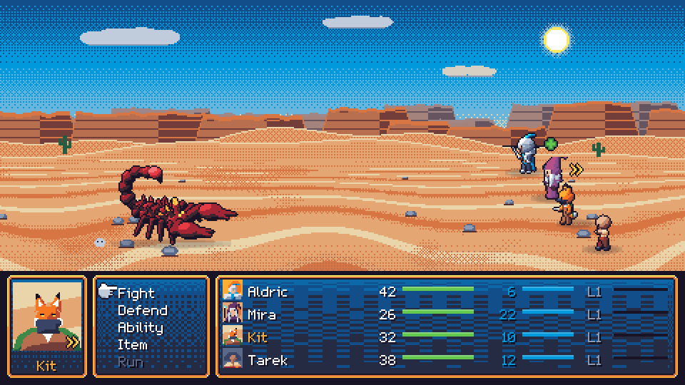

# Board RPG

*A desert tale* — an isometric pixel-art game that mixes a tactical board game with a classic JRPG, in the spirit of **Shining Force** meets **Final Fantasy**.



## The idea

Your heroes travel across isometric boards — villages, dunes, dungeons. Everything happens in turns ordered by speed, and every piece moves with its own **chess-like pattern**: the Knight leaps in L-shapes, the Thief dashes like a queen, the Monk strides like a rook, the Magician glides diagonally. Heights matter: you can only climb one block at a time.

Heroes can **team up into parties** that move as one. When a piece moves onto an enemy, the game switches to a **Final-Fantasy-style side-view battle**, then returns to the board.

On the board you prepare those fights. You set cells on fire, freeze the sand so enemies slide, hide traps, or float over quicksand. When no enemies are around, the turns stop and you walk freely: talk to villagers, trade in shops and follow quests.



## Highlights

- **Tactical boards:** move patterns, heights, parties, and field effects (burning, poison, ice, sticky mud) that hit whoever lands on them. Ice bridges rivers, fire burns flowers and spreads over grass. You can rotate the map in 90° steps to see behind hills and houses.
- **Classic battles:** Fight / Defend / Ability / Item / Run, turn order by speed, ambushes and first strikes, elemental weaknesses and status effects.
- **Four heroes:**
  - **Aldric** the Knight
  - **Mira** the Magician
  - **Kit** the fox Thief
  - **Tarek** the Monk
- **A living village:** villagers you can walk through and talk to in a close-up scene. There are shops, an inn and quests with hidden endings.
- **Data-driven:** classes, abilities, items, enemies, maps, dialogs and quests are all plain YAML files in [`data/`](data/). Maps are character grids with layers, like RPG Maker 2000. A visual editor is planned.
- **Everywhere:** runs in the browser on desktop and phones (touch controls, fullscreen landscape) and works with a gamepad. Desktop and mobile apps come later.

| Talking to the elder | Reading an enemy's reach |
|---|---|
|  |  |



## The demo

Connected boards, from the coast into the desert and up a mountain:

- **Saltmere Harbor:** the heroes arrive by ship. Sailors on the docks, and barrels and jars worth searching.
- **Greenwood River:** a forest cut in two by a river you can only cross on ice, and old stairs overgrown with flowers that only fire clears.
- **Elvenglade:** a village of small elves, whose mage sells the *Ice* spell.
- **Sunken Ruins:** skeletons everywhere, and some of them get up. Hidden traps and an invisible chest that only the thief's *Discover* reveals.
- **Sandhollow:** a peaceful desert village with a market, an inn and villagers.
- **Scorpion Dunes:** the wild road east, full of scorpions and condors and ruled by the **Emperor Scorpion**.
- **Temple Mountain:** a zig-zag climb to the Temple of the Still Sky. Three monks promise to teach *Holy* if the heroes bring back three stolen tokens:
  - **Reed Pond:** fish-folk in deep water, which only lightning reaches (and it runs through the whole pond).
  - **Mirage Tower:** it only appears to those lost in the Endless Dunes. The heroes split up and climb in two teams, opening floor gates for each other.
  - **Verdant Isle:** by ship, a jungle of fruit and vegetables that fight together – soak the ground, zap it, wall you in with brambles, burn it.
- **Hall of Fears and the Grave Toad:** the heroes face shadows of themselves, and the orb's light opens a cave where an undead toad swallows heroes whole.

There is a prologue quest, two main quest chains (one with a sub-quest that has a hidden ending) and one side quest.

## Running it

```bash
npm install
npm run dev          # http://localhost:5173
npm run dev:phone    # also serves on your local network for testing on a phone
```

| Action | Keyboard | Gamepad | Touch |
|---|---|---|---|
| Move cursor / menus | Arrows or WASD | D-pad / stick | Tap (drag to scroll the map) |
| Select | Z / Enter / Space | A | Tap (targets: tap twice) |
| Back | X / Esc | B | Back button |
| Menu | M / Tab | Start / X / Y | Menu button |
| Rotate map | Q / E | LB / RB | Rotate buttons |

## Development

- `npm test`: unit tests for the rules, content validation and a scripted playthrough.
- `npm run e2e`: Playwright browser scenarios (the dev server must be running).
- `npm run build`: type check and production build.
- `npm run art`, `npm run audio`: regenerate the procedural pixel art and chiptune music.
- `node tools/screenshots.mjs`: recapture the images in this README.

The architecture is strictly layered:
- **`src/core`:** pure game rules, no Phaser.
- **`src/engine`:** a generic Phaser 4 toolkit.
- **`src/game`:** the scenes and UI.

See [CLAUDE.md](CLAUDE.md) for the architecture, [docs/game-design.md](docs/game-design.md) for the full design, and [docs/packages.md](docs/packages.md) for the roadmap.

Built with TypeScript, [Phaser 4](https://phaser.io), Vite and Vitest.
